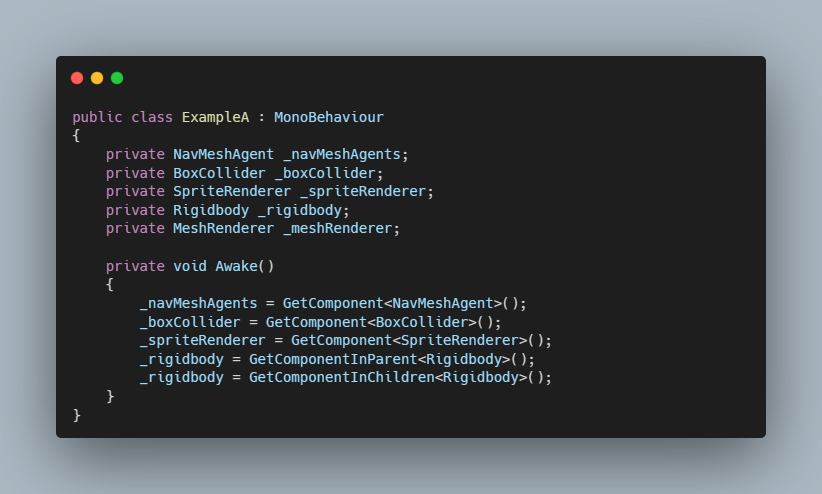

# GetComponent Generator For Unity

[Medium Blog](https://medium.com/@EnescanBektas/using-source-generators-in-the-unity-game-engine-140ff0cd0dc).

#### A Source Generator that automates creating GetComponent methods  for components.

#### Additionally, it includes a Roslyn Analyzer. This allows  to provide a warning if the InitializeComponents method is not called.

#### DEFAULT
\

#### WITH SOURCE GENERATOR

