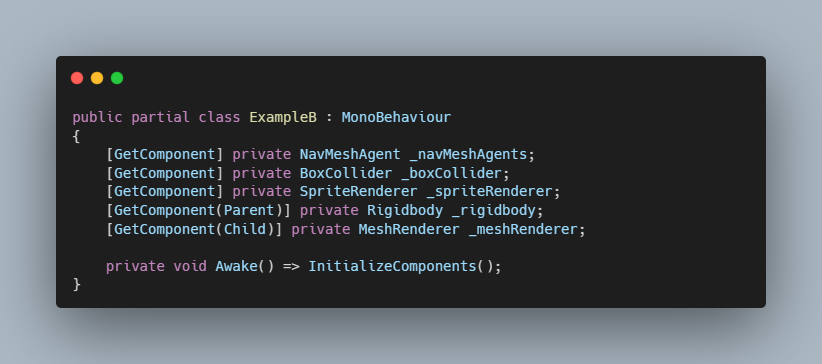

# GetComponent Generator For Unity

[Medium Blog](https://medium.com/@EnescanBektas/using-source-generators-in-the-unity-game-engine-140ff0cd0dc).

#### A Source Generator that automates creating GetComponent methods  for components.
#### Additionally, it includes a Roslyn Analyzer. This allows  to provide a warning if the InitializeComponents method is not called.

#### ####

>#### Default Way
\

>#### With Source Generator

https://user-images.githubusercontent.com/45511976/210048719-a76e51c0-61eb-405e-b121-07ddc0528524.mp4
